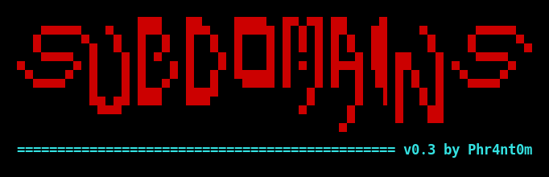
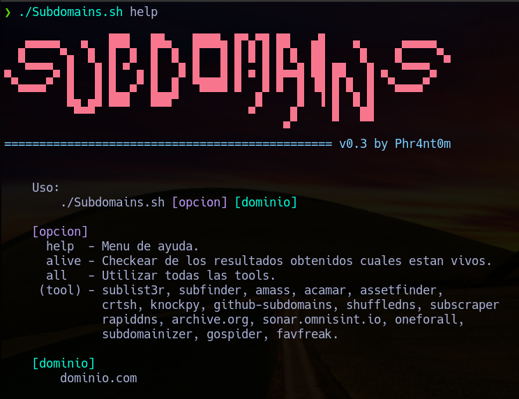

# README




## Subdomains.sh 
Simple script en bash que utiliza distintas herramientas para obtener una lista de subdominios, de IPs y de urls.

## Tools utilizadas
- Sublist3r
- Subfinder
- Amass intel
- Amass enum
- Acamar
- Assetfinder
- CERT SH
- Knockpy
- Github-Subdomain
- Shuffledns
- SubScraper
- Rapiddns
- Archive.org
- Sonar.omnisint.io
- OneForAll
- Subdomainizer
- GoSpider 
- Favfreak

**Otras tools**
* httpx
* jq
* curl
* python3


## Modo de Uso:



Ver la ayuda: 
```
./Subdomains.sh help
```

Utilizar todas las Tools>
```
./Subdomains.sh all dominio.com
```

Utilizar una tool especifica:
```
./Subdomains.sh sublist3r dominio.com
```

Chequear si estan vivos los nuevos subdominios
```
./Subdomains.sh alive dominio.com
```

## Archivos que creados utilizando la opcion `all`

|    ARCHIVO                        |                                   DETALLE                             |
|:---------------------------------:|:----------------------------------------------------------------------|
| alive.info.json                   | Detalle de urls validas                                               |
| ip_list.txt                       | Listado de IPs                                                        |
| alive.txt                         | Listado de Urls validas                                               |
| Subdomains.txt                    | Listado de subdominios                                                |
| status.md                         | Archivo markdown con el detalle de los datos obtenidos con cada tool  |
| .Sub-*.txt                        | Listado de subdominios de tool especifica                             |
| .Sub-sublister_202210191011.txt   | Listado de subdominios obtenidos con sublister                        |
| OthersPortsAlive.txt              | Listado de url con los puertos 81,8443,8000,8001,8080,8181            |
| OthersPortsAlive.json             | Detalle de las url con otros puertos                                  |
| JS-Gospider.txt                   | Listado de JS encontrados                                             |


## Diccionarios

* /SecLists/Miscellaneous/dns-resolvers.txt
* /SecLists/Discovery/DNS/subdomains-top1million-110000.txt

```
mkdir -r ~/Tools/Wordlist
cd wordlist
git clone https://github.com/danielmiessler/SecLists.git
```
### Directorio de Tools:
Las tools se deberan instalar en el directorio
`/home/usuario/Tools/Recon/`
```
mkdir -r ~/Tools/Recon
cd ~/Tools/Recon
```


## Instalacion de Tools
### Sublist3r
```
git clone https://github.com/aboul3la/Sublist3r.git 
cd Sublist3r
pip install -r requirements.txt
```

### Subfinder
```
go install -v github.com/projectdiscovery/subfinder/v2/cmd/subfinder@latest
```
**Nota:** hay que editar el archivo de configuracion 
`~/.config/subfinder/provider-config.yaml`


### Amass 
```
go get -v github.com/OWASP/Amass/v3/...
cd $GOPATH/src/github.com/OWASP/Amass
go install ./...
```

O tambien se puede instalar por apt:
```
sudo apt install amass
```


### Acamar 
```
git clone https://github.com/si9int/Acamar.git
cd Acamar
pip install -r requirements.txt 
```
### Assetfinder
```
go get -u github.com/tomnomnom/assetfinder
```


### crtsh.py - CertificateTransparencyLogs
```
git clone https://github.com/YashGoti/crtsh.py.git
```


### KnockV3
```
git clone https://github.com/amustaque97/KnockV3.git
cd knock
pip install -r requirements.txt
```
**Nota:**Hay que configurar y agregarle la api key de virustotal (API_KEY):
`config.json`


### Github-subdomain
```
git clone https://github.com/gwen001/github-search.git
```
**Nota:** Agregar apikey de github en 
`./Subdomains.sh`


### shuffledns
```
GO111MODULE=on go get -v github.com/projectdiscovery/shuffledns/cmd/shuffledns
```
### SubScraper
```
git clone https://github.com/m8r0wn/subscraper
cd subscraper
python3 setup.py install
```

### OneForAll 
https://github.com/shmilylty/OneForAll.git
```
git clone https://github.com/shmilylty/OneForAll.git
cd OneForAll
pip install -r requirements.txt 
```

### Subdomainizer
```
git clone https://github.com/nsonaniya2010/SubDomainizer.git
cd SubDomainizer
pip3 install -r requirements.txt
```

### GoSpider
```
GO111MODULE=on go get -u github.com/jaeles-project/gospider
```

### FavFreak
  ```
git clone https://github.com/devanshbatham/FavFreak
cd FavFreak
pip install -r requirements.txt
```
## Instalacion
```
cd ~/Tools/Recon
git clone https://github.com/phrantom/Subdomains.git
cd Subdomains

```
Crear enlace simbolico para ejecutarlo desde cualquier ubicacion

```
sudo ln -s ~/Tools/Recon/Subdomains/Subdomains.sh /usr/bin/Subdomain.sh
```
